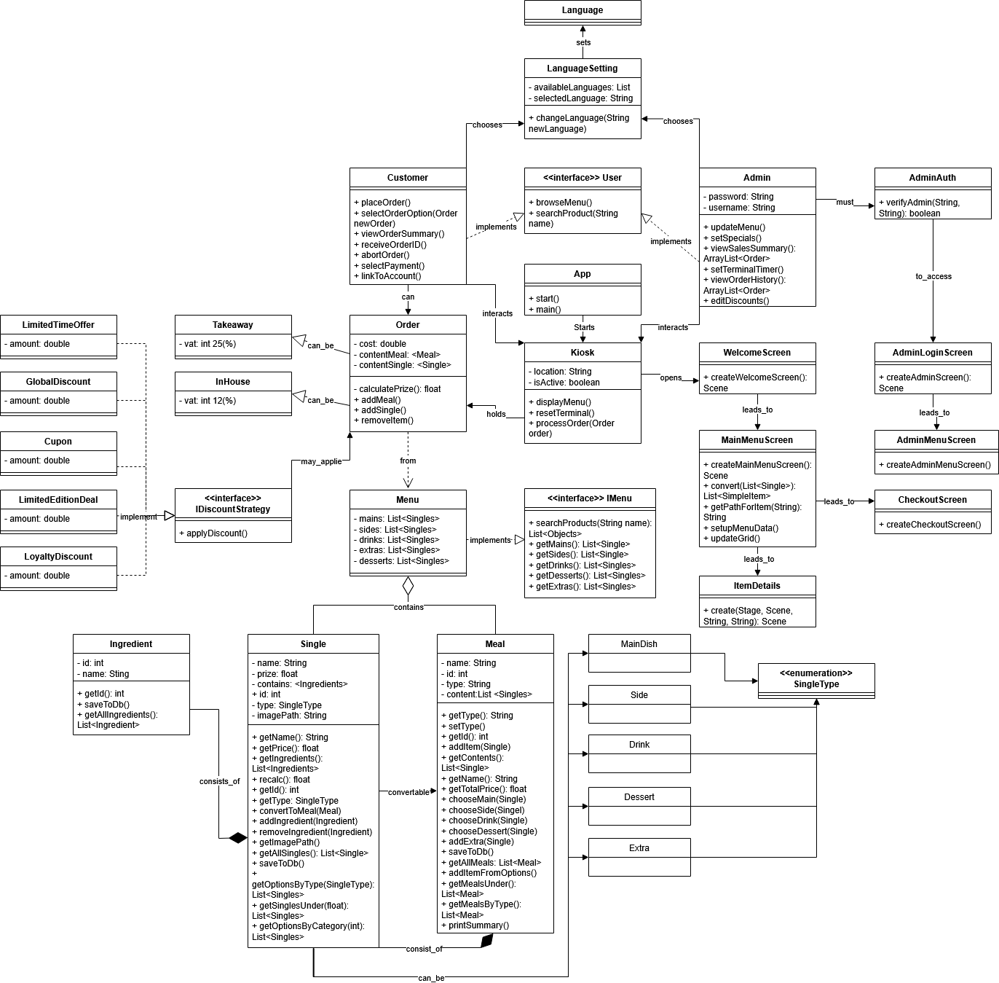
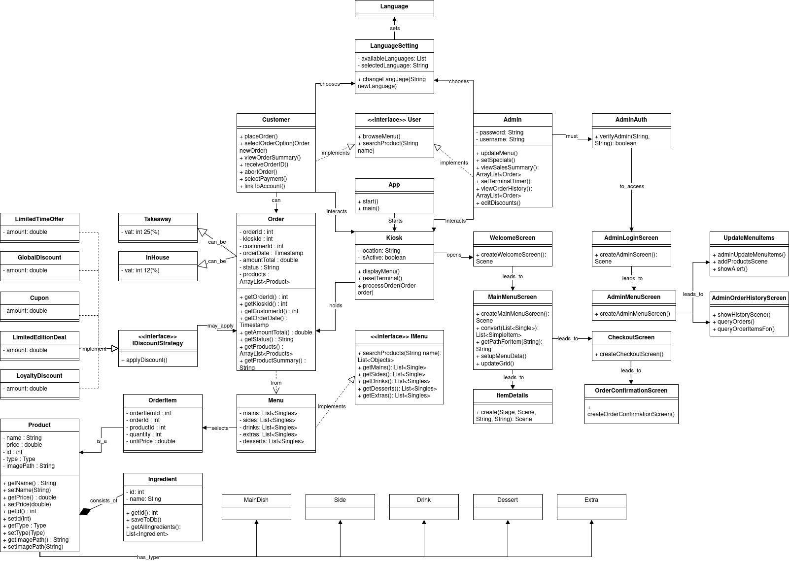
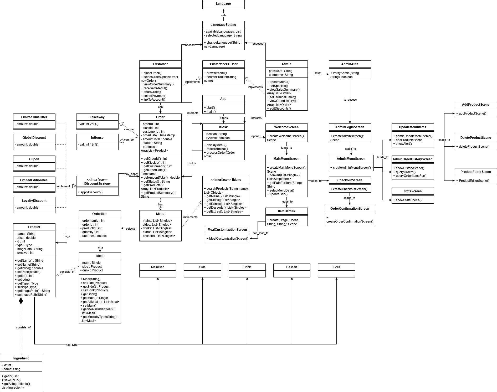
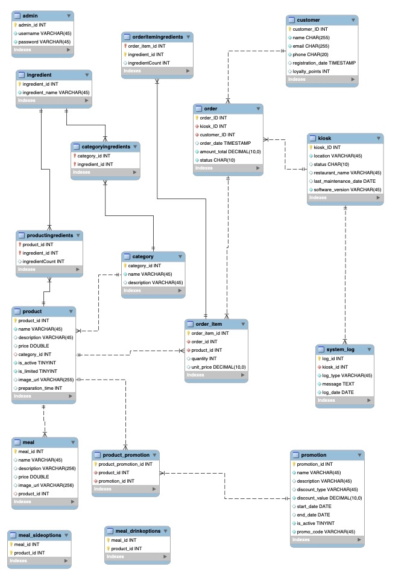
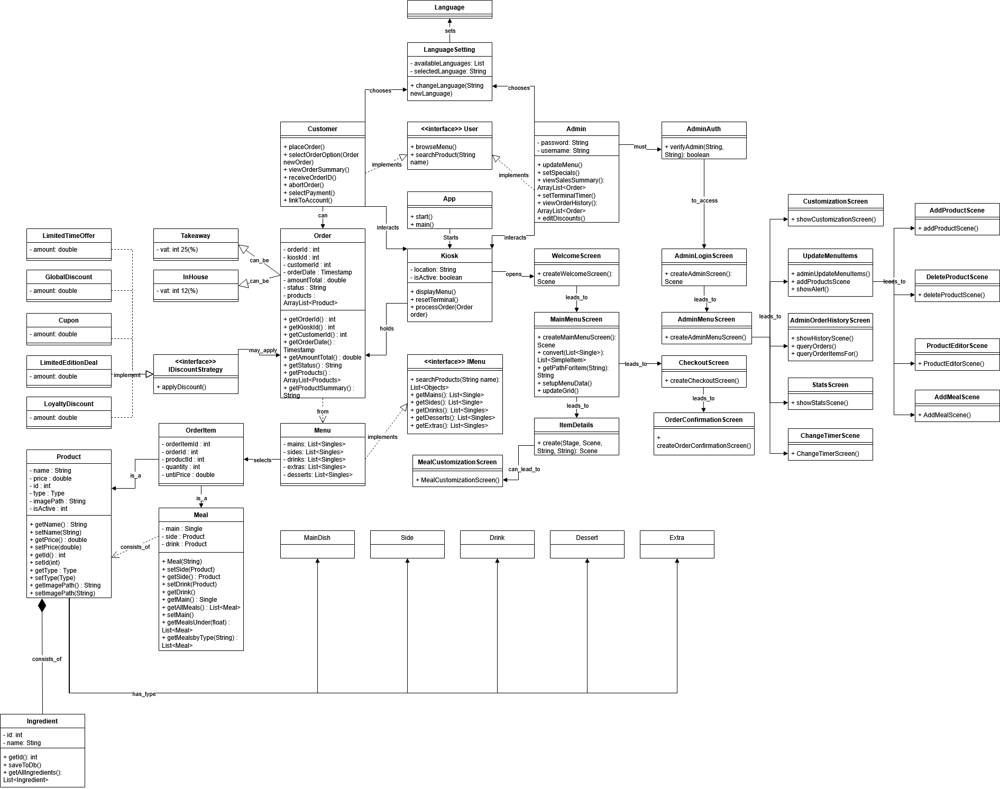

Documentation:

Our Group (Clarke) consists of:
Achilleas Feratidis
Vincent Hawel
Jakob Hinze
Arseny Isaev
Vuk Vasovic
Ignas Vilimaitis
Michelle Weber

In this documentation we will document our thought process and our plans/doings to create the project as a team.
Our first meetup was on the 02.04.2025.
In this we discussed our inital toughts and ideas.
We also created the user/admin stories:

Then we split up into smaller groups to work on a design, database and class diagramm.
We met up again on the 08.04.2025 to check in on everybody discuss some more thoughts and talk about the use of Gitlab.
We are also using a Discord Server to always stay in touch.

For the design we used a Burger place as an example. The design was done with keynote.
We focused on the core mechanics and also a button with the ability to change the language.
[design draft](<references/Clarke Design v0.9.pdf>)

For the database we are using MySQL. In addition to storing the products we are also storing the list of ingredients
and a list of the ingredients which have been modified by the customer. With that feature we can allow customization of the ingredients.
We are also storing the orders in a table to make it possible to connect a kitchensystem in the future or to see the order history.
In addition to that we have an admin table with credentials which is linked to a role table to set permission in the form of Role Based access
controll.
We are also keeping logs to know who accessed the database and when to provide a bit of security.

Then we also created a UML class diagramm to have a bit of a plan of that classes we need, how they are connected and also which methods should be
in them. Because its such a big project the class diagramm will ofcourse change overtime especially the methods. But its good to have some kind of
a plan going into programming.

Sprint 1 (Week 17)

This week we worked on the welcome screen, main menu and admin login functionality, namely customer stories 1, 5 and admin story 5.

For the welcome screen Michelle and Arseny added the main elements and added button functionality to make them let the user travel to the other 2 screens.

For the admin screen Ignas and Jakob implemented the login functionality and set the scene for the admin menu. Jakob also set up the meetings, cleaned up the repository with Arseny and did all the organisational work and merging. Ignas also worked on testing and populating the database and helping others with the database connectivity, made the error mesage according to the design. 

The main menu screen was done by Vuk, Vince and Michelle. Vuk made the whole menu interactable. Vince added animations and connected items to the next scene. Vince updated the uml diagram.

Achilleas mainly worked on the database connectivity. Prepared the methods with queries for various situations.

Michelle also worked on helping with database connectivity, merging and adjusting code according to checkstyle.

We had 3 meetings, 1 in person on Thursday, 1 on Friday and 1 on Monday on Discord.

Sprint 2 (Week 18)

This week we worked on the product screen and the checkoutscreen.

For the product screen Ignas Vuk and Vince made the user able to choose different ingredients and put the product into the cart. Ignas also added the add to cart button and was invovled in putting the whole item screen together.

Vuk did the plus and minus buttons with logic to limit quantity from 0 to 9. He aslo did the igredient table and functional button to browse via the ingredients according to the design. Vuk also worked on the layout of the item screen.

Vince worked on the design allignment of the product screen, added memory feature to the ingredient list and updated the diagram.

Arseny added product description. Also he checked that everything is working when we merged.

Jakob worked on the merging together with Arseny. Jakob also made the initial layout for the cart grid, made the reusable product tiles. He also worked on the cart functionality so the user can add an item into the cart and see it in the checkout. He also worked on improving the item class, did all the organisational work and most of the future planning.

For the Checkout screen Achilleas and Michelle worked on the buttons. Achilleas also worked on the promocode field. Michelle also did the Order confirmation screen added default text into the promocode text field and the layout final adjustments.

Arseny added rows to the cart and pages with the page counter.

We had 1 meeting in person after the client meeting on Wednesday and 3 meetings on Discord. One on Thursday, one on Sunday and one on Monday.

Sprint 3 (Week 19)

This week we primarily worked on the admin menu features, fixing some bugs, reworking the product class, and working with the database.

Jakob reworked the product class. As always, he also did all the organisational work and helped people pick user stories for the next sprint. He also collaborated with teammates in remote coding sessions, solving or helping to solve various problems. He connected the list of ingredients in the product screen with the database and made sure they show the correct quantity as well as update it. He also made each product be copied into a custom product type so that in the checkout the user can have the same product with different ingredients.

Michelle cleaned up the repository at the start of the sprint. She also reworked the checkout screen button to track and constantly update the total price of the contents of the cart. She worked on storing the orders into the database with Jakob and added the emptying cart functionality where needed.

Vuk prepared the initial admin main menu with Ignas. He made the custom tickbox and dropbox classes for the admin menu. The dropbox avoids writing the category of the product manually and instead lets the user choose the existing one.

Ignas slightly reworked the admin login screen design. He created a custom button class for the admin menu. He made the ingredient table that shows the list of ingredients for the new product based on the chosen category.

Ignas and Vuk also added images for the default product upon creation so that the products would fit nicely within the product grid and to zero out all the null-value-related errors. They both also worked on handling merge-related issues. They did all the testing related to the creation of the new item.

Vince worked on the order history screen. He did both the UI and functional aspects of the screen. He also fixed the product not showing up in its corresponding column. He made reusable code that can be used for future receipt print functionality.

Achilleas was involved in working on tracking the orders and testing the database. He also helped debug the code by finding the instances of the previous product class and replacing them with the updated one. He then worked on the product search bar that is needed for both the admin and the customer menu.

Arseny was fixing some bugs he didn’t deal with during the previous sprint: fixing the page counter, page-swapping buttons' behavior, registering item quantity changes, and recording them to the cart. He also added a few ingredients to the database.

We had one 1-hour-long meeting on Discord on Monday to discuss our work and plan out the next sprint. Throughout the whole sprint, we were actively discussing the sprint and sharing the latest work.

Sprint 4 (Week 20)

This week we focused on implementing the meals functionality, improving database efficiency, expanding the admin menu, as well as adding search features and translating the ui into Swedish.

Vuk added the meals category and created scenes for meal combos with their side and drink options. He also populated the meal, meal_sideoptions, and meal_drinkoptions tables in the database and fetched the data into the corresponding screens. He also worked on theoverall look of the new screens, added a glow effect to the selected item, and designed new meal pictures in Photoshop which were then integrated into the UI.

Ignas reworked the database connection by adding a new dependency that allows for connection pooling. This prevents the creation of a new database connection for each query call improving performance. He also moved all the SQL queries from different classes into a single Query.java file, simplifying future maintenance and access.

Michelle first did code cleanup. She also added getters and setters for is_active and description in the product class. In the admin menu, she implemented a price change section and a comprehensive product editor with editable columns for name, is_active status, description, and price. She also added functionality for product deletion and refactored the admin menu code by moving the product editor, product addition, and deletion scenes into separate classes, reducing file size. She also made helper methods to reduce code duplication.

Jakob set up the database side for the meal functionality. He implemented adding meals to the cart and made sure this is stored in the database. He also worked on upselling regular products into meals wherever applicable. He also did all the organisational work and merging

Achilleas added search bars for both the admin and customer menus. He also created a “Terms of Use” popup for the customer interface.

Vince created the sales summary stats section, featuring four different graphs: sold products, orders per day, orders by hour, and revenue by product. He improved the visual appearance of the order history table and also contributed to merging and translating.

Arseny translated both the admin and customer menus. He also moved the database to allow more simultanious connections. Also worked on merging.

We had 2 meetings. One after the meeting with client in person, to discuss this sprints tasks in details and one in discord on monday to wrap up the sprint. Each meeting was an hour long.

Sprint 5 (Week 21)

This week we continued working mainly on the admin features and polishing the customer interface. Namely, creating new meals via the admin menu, implementing an inactivity timer, improving the search bars and making the ui customizable.

Vuk worked together with Jakob on the functionality to add a new meal to the database through the admin menu. He Also fixed the layout and the look of it and some buttons. He also addressed a design issue by resizing the drop box and list view in the new product screen after client feedback that they were too small. Vuk also experimented with hover shadow animations and applied them to the category names in the main menu and the search button in the top-right corner.

Michelle implemented a global inactivity timer that now runs across the entire customer menu. If the user is inactive for a set amount of time, a popup appears, and if there is no interaction, the application automatically redirects the user back to the welcome screen. The timer can be edited in the corresponding admin menu section. She also impleneted the translation feature for the timer editor. Michelle also added getters and setters for preparation time in the product class and made the preparation time column in the admin product table editable directly into the database.

Jakob worked on implementing the new meal creation feature with Vuk. He also worked on the stacking bug. Additionally, as with all previous sprints, Jakob handled organizational responsibilities and planning for both this and the nex sprint.

Vince worked on the design costomization features. He added support for changing the kiosk name, background color, and buttons via the admin menu. He also added another graph to statistics screenand also cleaned up methods for the stats screen. He also updated the diagram to reflect the latest changes.

Ignas added the global discount functionality, that allows the admin to apply a global discount across all products. He also implemented the option to import images for newly added products. He also worked on merging.

Achilleas integrated the search bar into both the item edit and item remove screens, enhancing usability of these two screens. He also further improved the search bar's performance and visuals in the main menu screen for the customer, making it more intuitive and aligned with the overall interface design.

Arseny worked with Vince on implementing kiosk customization options. He also worked on bug fixing and merging with Ignas and Vince.

We had some brainstorming and colloborative sessions in small groups while working on stories and merging. We had one short meeting after the previous metting with TA in person and one long meeting on discord to wrap up the current sprint and plan the next one on Discord. During the sprint we were also actively communicating in Discord in text.

Sprint 6 (Week 22)

For the last sprint we focused on Bugfixing and adding two features.
One of them was that the customer can send the reciept to his email if he wants.
Arsney and Jakob worked on that. Jakob focused on the Logic of sending the actual e-mail. That means understanding how Jakarta mail works and also getting a reciept string.
Arsney worked on the screen where the customer can input his email adress. For that we needed a keyboard on the screen because on the real kiosk a customer would not have a physical keyboard.
JavaFX has a build in keyboard and we thought of using it, but it has two flaws. It does not work on a mac which is not that ideal because Arsney and Jakob both work with macs. And also it was not that easy to customize the keyboard so we could not let it fit our theme that easy. So Arsney made a custom one from scratch.

Jakob also finally fixed the quantitys bug.

The other feature was a box to enter a promocode. Ignas and vuk worked on that, and modified the database to store promocodes.
Now its possible to put in promocode to get a certain precent off.

Ignas also worked on a screen that makes it able to add a new ingredient to the database.

Vuk fixed some bugs with converting singles into a meal, he also fixed a bug that the customer is now not able to add no drink or side to the meal. He also did some animations for the buttons.

Achilleas worked on activ filtering in the search bar and autocomplete suggestions.

Vince cleaned up the sales statistics and moved some code into the sql class and other separated classes.
He made the theme customization savable and so that they load on the appstart, also u can now reset the theme.
Also the custom name is saveable now and loads on start of the app.

Michelle corrected checkstyle issues throught out the whole project. She also moved a lot of queries into the query file and ensured that the code is still working right.
Also she worked on the worked on the estimated time calculation. Its takes now the real daytime into consideratoion.
She also removed almost all of the handed down connection variables.
Also she did some testing and fixed a lot of smaller bugs.

We had a lot of meetings in smaller groups to do some brainstorming on the features and we had one big meeting on discord to wrap up the week. Through out the week we had communication via text on discord.

The final class diagram and databse scema:

