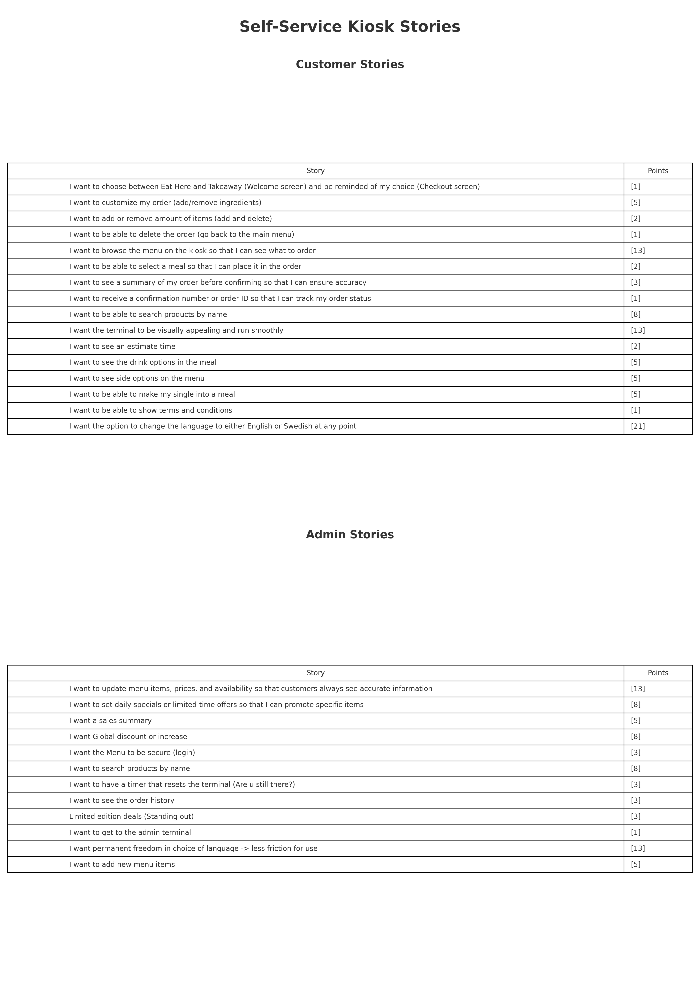
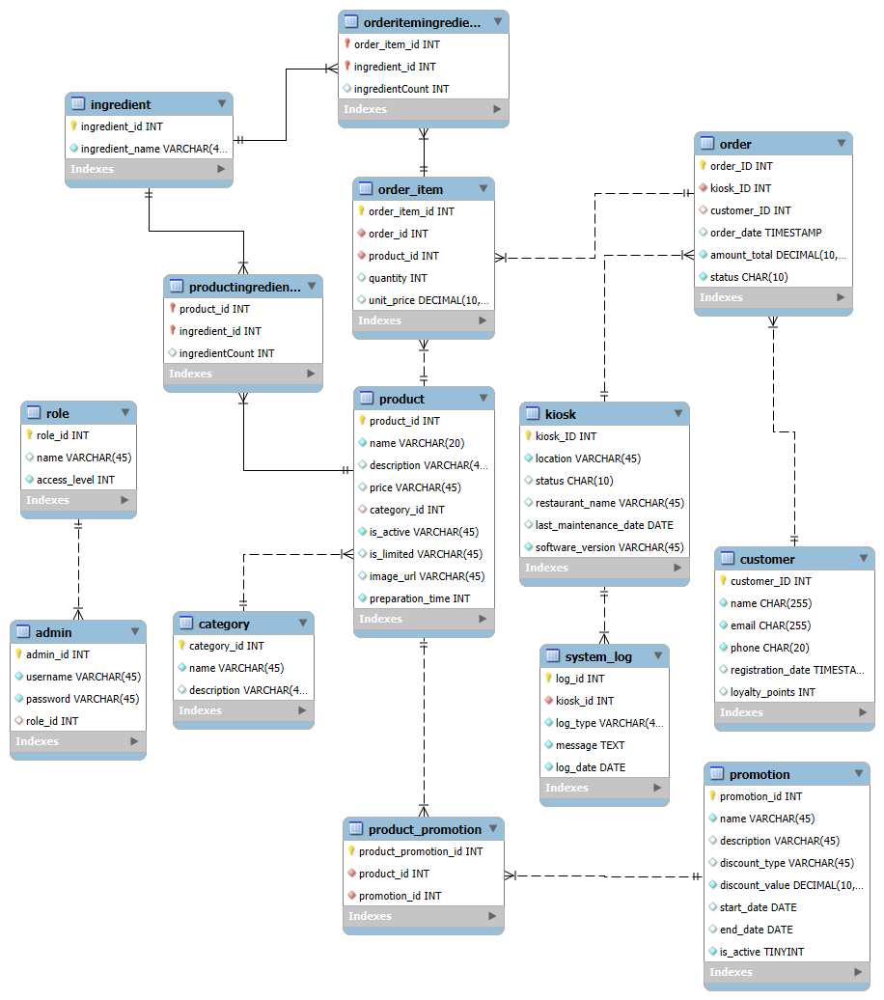
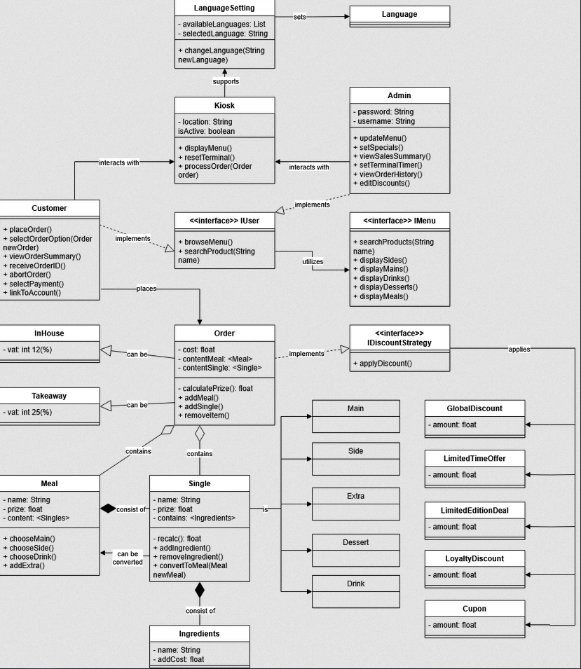
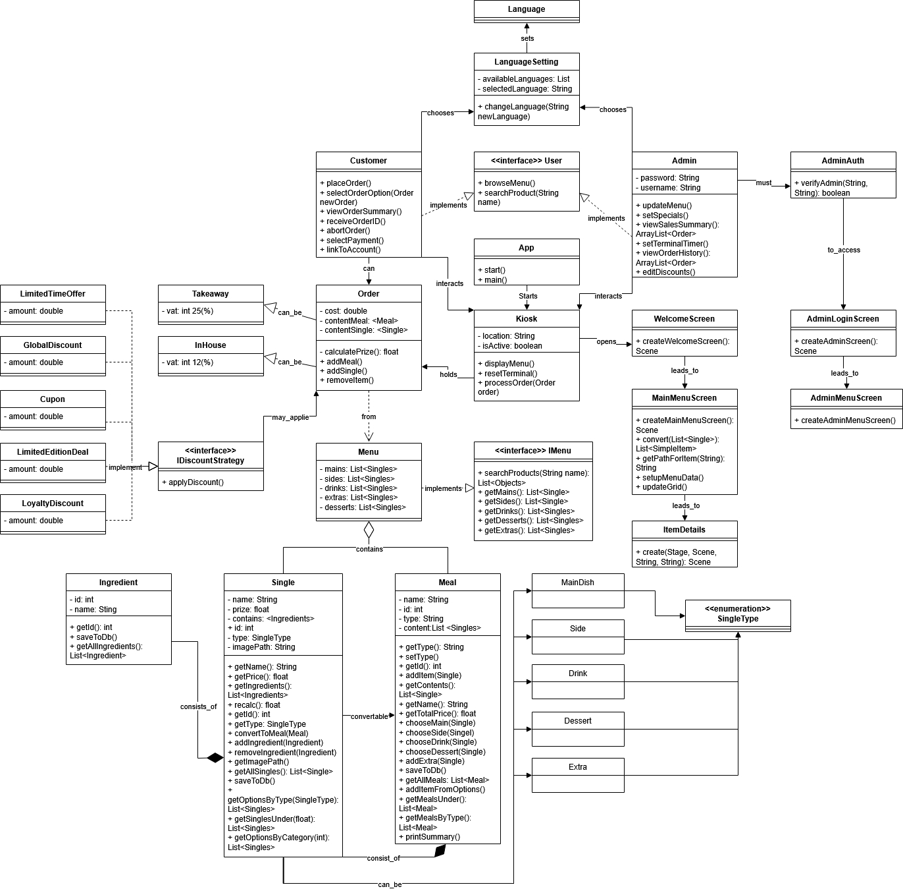

Documentation:

Our Group (Clarke) consists of:
Achilleas Feratidis
Vincent Hawel
Jakob Hinze
Arseny Isaev
Vuk Vasovic
Ignas Vilimaitis
Michelle Weber

In this documentation we will document our thought process and our plans/doings to create the project as a team.
Our first meetup was on the 02.04.2025.
In this we discussed our inital toughts and ideas.
We also created the user/admin stories:

Then we split up into smaller groups to work on a design, database and class diagramm.
We met up again on the 08.04.2025 to check in on everybody discuss some more thoughts and talk about the use of Gitlab.
We are also using a Discord Server to always stay in touch.

For the design we used a Burger place as an example. The design was done with keynote.
We focused on the core mechanics and also a button with the ability to change the language.
[design draft](<references/Clarke Design v0.9.pdf>)

For the database we are using MySQL. In addition to storing the products we are also storing the list of ingredients
and a list of the ingredients which have been modified by the customer. With that feature we can allow customization of the ingredients.
We are also storing the orders in a table to make it possible to connect a kitchensystem in the future or to see the order history.
In addition to that we have an admin table with credentials which is linked to a role table to set permission in the form of Role Based access
controll.
We are also keeping logs to know who accessed the database and when to provide a bit of security.

Then we also created a UML class diagramm to have a bit of a plan of that classes we need, how they are connected and also which methods should be
in them. Because its such a big project the class diagramm will ofcourse change overtime especially the methods. But its good to have some kind of
a plan going into programming.

Sprint 1 (Week 17)

This week we worked on the welcome screen, main menu and admin login functionality, namely customer stories 1, 5 and admin story 5.

For the welcome screen Michelle and Arseny added the main elements and added button functionality to make them let the user travel to the other 2 screens.

For the admin screen Ignas and Jacob implemented the login functionality and set the scene for the admin menu. Jacob also set up the meetings, cleaned up the repository with Arseny and did all the organisational work and merging. Ignas also worked on testing and populating the database and helping others with the database connectivity, made the error mesage according to the design. 

The main menu screen was done by Vuk, Vince and Michelle. Vuk made the whole menu interactable. Vince added animations and connected items to the next scene. Vince updated the uml diagram.

Achilleas mainly worked on the database connectivity. Prepared the methods with queries for various situations.

Michelle also worked on helping with database connectivity, merging and adjusting code according to checkstyle.

We had 3 meetings, 1 in person on Thursday, 1 on Friday and 1 on Monday on Discord.

Sprint 2 (Week 18)

This week we worked on the product screen and the checkoutscreen.

For the product screen Ignas Vuk and Vince made the user able to choose different ingredients and put the product into the cart.
Vuk did the plus and minus buttons.
Arsney worked on the Product description and the layout. Also he checked that everything is working when we merged.
Jakob worked on the merging together with Arsney. And on the cart functionality so the user can add an item into the cart and see it in the
checkout.

For the Checkout screen Achilleas and Michelle worked on the buttons. Michelle also did the Order confirmation screen.
Arsney did the layout for the items in the cart.

We had 3 Meetings on Discord. One on Thursday, one on Sunday and one on Monday.
